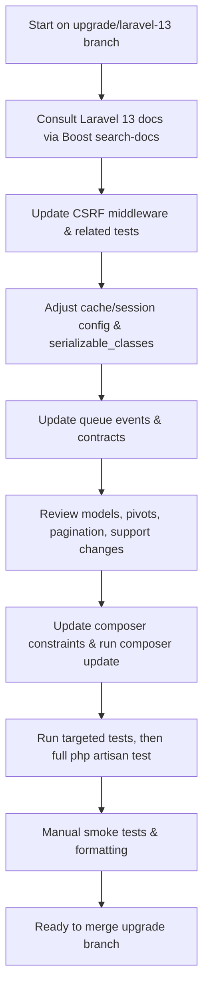

### Goals

- **Upgrade framework**: Move from `laravel/framework:^12.53.0` to `^13.0` and align related packages (Pest, Tinker, Boost, etc.).
- **Apply breaking-change fixes**: Systematically address Laravel 13 breaking changes (CSRF middleware rename, cache serialization, events, pagination views, etc.).
- **Preserve behavior**: Ensure authentication, CSRF protection, cache, queues, and UI work as before.
- **Verify with tests**: Run targeted and full test suites to confirm a clean upgrade.

### High-level workflow

- **Work on dedicated branch**: Create and use an `upgrade/laravel-13` branch, leaving the main branch stable.
- **Documentation-first via Boost**: Use the Laravel Boost `search-docs` tool with queries like `"upgrade 13"`, `"csrf middleware rename"`, `"cache serializable_classes"`, scoped to `laravel/framework`, Pest, and related packages before each major change category.
- **Iterative upgrades**: Update configuration and code patterns in small, testable steps; then bump dependencies and re-run tests.

### Step 1: Baseline & inventory

- **1.1 Inspect current versions and constraints**
  - Review `composer.json` (already shows `laravel/framework:^12.53.0`, `pestphp/pest:^4.4.1`, `laravel/boost:^2.3`) in `[composer.json](/home/amitavroy/code/personal/xpense-manager/composer.json)`.
  - Use Boost's `search-docs` for queries like `"application structure"`, `"Laravel 13 upgrade"` limited to `laravel/framework` to double-check the latest upgrade notes.
- **1.2 Establish a test baseline**
  - Plan to run `php artisan test` once before any dependency bumps to understand existing test status.
  - Note any existing failures to distinguish pre-upgrade issues from new ones.

### Step 2: CSRF / request forgery protection updates

- **2.1 Identify all CSRF middleware usages**
  - Search for `VerifyCsrfToken` and `ValidateCsrfToken` in `bootstrap/app.php`, route definitions, tests (Pest feature tests in `tests/Feature`), and any middleware references.
- **2.2 Update to `PreventRequestForgery`**
  - In `bootstrap/app.php` and any middleware configuration, switch imports and references from `VerifyCsrfToken` / `ValidateCsrfToken` to `Illuminate\Foundation\Http\Middleware\PreventRequestForgery` using patterns from the Laravel 13 docs (via `search-docs` query `"PreventRequestForgery"`).
  - Update tests that disable CSRF middleware (e.g., `->withoutMiddleware([VerifyCsrfToken::class])`) to use `PreventRequestForgery::class` instead.
- **2.3 Verify CSRF behavior**
  - Plan targeted feature tests for typical authenticated POST/PUT/DELETE flows (login, creating/updating accounts, transactions) to confirm tokens are still required and accepted.

### Step 3: Cache & session configuration

- **3.1 Review cache configuration**
  - Open `[config/cache.php](/home/amitavroy/code/personal/xpense-manager/config/cache.php)` to see current `prefix` and whether `serializable_classes` is present.
  - Use `search-docs` with queries `"cache serializable_classes"` and `"Laravel 13 cache serialization"` to confirm the recommended settings.
- **3.2 Add / adjust `serializable_classes`**
  - If the app stores objects in cache (e.g., custom DTOs, view models), identify them via a code search and explicitly list them in `serializable_classes` in `config/cache.php`.
  - If objects are not intentionally cached, set `serializable_classes` to `false` (or follow the Laravel 13 default) and adjust any code that caches models/objects to store primitives/arrays instead.
- **3.3 Session cookie / cache prefixes**
  - Review `[config/session.php](/home/amitavroy/code/personal/xpense-manager/config/session.php)` and confirm explicit `SESSION_COOKIE`, `CACHE_PREFIX`, and `REDIS_PREFIX` handling to avoid unexpected key/name changes.

### Step 4: Queue, events, and contracts adjustments

- **4.1 Queue events**
  - Search listeners and tests referencing:
    - `Illuminate\Queue\Events\JobAttempted` → update code from `$event->exceptionOccurred` to `$event->exception`.
    - `Illuminate\Queue\Events\QueueBusy` → change `$event->connection` to `$event->connectionName`.
  - Confirm expected behavior via `search-docs` queries like `"JobAttempted exception property"`.
- **4.2 Custom queue / cache drivers and contracts**
  - If there are custom implementations of `Illuminate\Contracts\Queue\Queue`, add the new size inspection methods (`pendingSize`, `delayedSize`, `reservedSize`, `creationTimeOfOldestPendingJob`).
  - For any custom cache store implementations, add a `touch($key, $seconds)` method to match the `Store` / `Repository` contract changes.
  - For custom `Dispatcher`, `ResponseFactory`, or `MustVerifyEmail` implementations (if present under `app/`), align their method signatures with the new contract methods (`dispatchAfterResponse`, `eventStream`, `markEmailAsUnverified`).

### Step 5: Routing, pagination, and views

- **5.1 Pagination view names**
  - Search for usage of `pagination::default` or `pagination::simple-default` in views or service providers; update them to `pagination::bootstrap-3` and `pagination::simple-bootstrap-3` as per the Laravel 13 docs if the app uses Bootstrap-based pagination.
- **5.2 Route domain precedence check**
  - Review `routes/web.php` and `routes/api.php` for domain-specific routes (e.g., `->domain(...)`), ensuring assumptions about matching precedence still hold under the new behavior.

### Step 6: Eloquent, models, and jobs

- **6.1 Model booting patterns**
  - Inspect models under `[app/Models](/home/amitavroy/code/personal/xpense-manager/app/Models)` for logic in `boot`/`booted` methods or trait boot methods that instantiate the same model class (which would now throw in Laravel 13). Refactor such logic to run outside the boot cycle.
- **6.2 Polymorphic pivot names**
  - If the app uses custom morph pivot models, review their table naming; if they relied on implicit singular names, explicitly set the `protected $table` property where necessary.
- **6.3 Serialized model collections**
  - Where model collections are serialized (e.g., queued jobs), confirm that restored eager-loaded relations do not break assumptions; adapt code if it expected relations to be unloaded.

### Step 7: HTTP client and notifications

- **7.1 HTTP client overrides**
  - Search for any custom subclasses of `Illuminate\Http\Client\Response` or overrides of `throw` / `throwIf` and ensure their method signatures match the new ones.
- **7.2 Notifications**
  - Update any tests or localization files that assert the default password reset subject line to the new default (`"Reset your password"`) if they rely on framework defaults.
  - If using `#[DeleteWhenMissingModels]` or `$deleteWhenMissingModels` on notifications, rely on the new behavior and remove any manual workarounds for missing models.

### Step 8: Support utilities and testing behavior

- **8.1 Manager `extend` callbacks**
  - For any uses of `$manager->extend(...)` where closures relied on `$this` referring to a service provider, adjust the closures to capture needed values using `use (...)` and align with the new binding behavior.
- **8.2 `Str` factories in tests**
  - If tests customize `Str::createUuidsUsing`, `Str::createUlidsUsing`, etc., ensure factory setup happens in each test or per-test setup, as factories now reset between tests.
- **8.3 `Js::from` expectations**
  - Adjust tests that compare JSON output containing Unicode characters to account for unescaped Unicode by default.

### Step 9: Dependency upgrades via Composer

- **9.1 Update composer constraints**
  - In `[composer.json](/home/amitavroy/code/personal/xpense-manager/composer.json)`, update:
    - `"laravel/framework": "^13.0"`.
    - Consider bumping `laravel/tinker` to `^3.0` and keeping `pestphp/pest` at `^4` (compatible) as per the upgrade guide.
  - Ensure `laravel/boost` remains compatible with Laravel 13 by checking its docs via `search-docs` (`"laravel boost"`, `"Laravel 13"`).
- **9.2 Run Composer update**
  - Plan to run `composer update` (or `composer require laravel/framework:^13.0 --with-all-dependencies`) on the upgrade branch and resolve any dependency conflicts.

### Step 10: Application smoke tests & Pest tests

- **10.1 Targeted tests for touched areas**
  - For each changed area (CSRF, queues, cache, notifications), ensure relevant feature/unit tests exist or add them under `tests/Feature` or `tests/Unit` following existing Pest patterns.
  - Use Boost `search-docs` for Pest 4 patterns when adding/updating tests.
- **10.2 Run automated tests**
  - Run focused tests first (e.g., specific feature files or `--filter` names tied to CSRF, cache, or queues) to quickly validate core behavior after changes.
  - Then run the full suite with `php artisan test` as requested.
- **10.3 Fix regressions**
  - Iterate on failing tests, consulting `search-docs` whenever an error indicates a behavior change.

### Step 11: Final verification and cleanup

- **11.1 Manual functional checks**
  - Manually exercise key user flows: login, account and category management, creating/updating/deleting transactions, reviewing balances.
- **11.2 Code style and tooling**
  - Run `vendor/bin/pint` for PHP formatting and `npm run lint` / `npm run format` for frontend if any JS/TS is touched during the upgrade.
- **11.3 Prepare for merge**
  - Ensure the upgrade branch has green tests, updated `composer.lock`, and any relevant documentation notes (e.g., in `README.md` if there are operational changes like new cache/session envs).

### Simplified flow diagram

